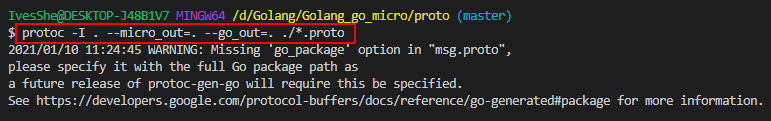

# Golang go-micro

# go-micro的框架結構


# 下載安裝

```bash
go get -u -v github.com/micro/micro
go get -u -v github.com/micro/go-micro
go get -u -v github.com/micro/protoc-gen-micro
```


# msg.proto

```bash
syntax = "proto3";

// 定義需要的結構體參數
message InfoRequest{
    string username = 1;
}

message InfoResponse{
    string msg = 2;
}

// 定義接口
service Hello{
    rpc Info(InfoRequest) returns (InfoResponse){
        
    }
}
```

# 生成.go文件(會有兩個檔案，另一個是micro)

```bash
protoc -I . --micro_out=. --go_out=. ./*.proto
```





# 生成的文件似乎有點問題

報了這個錯誤，但這些包下了對應的go get也捉不到


後來靈機一動將v2拿掉


就可以運行了


未完待續